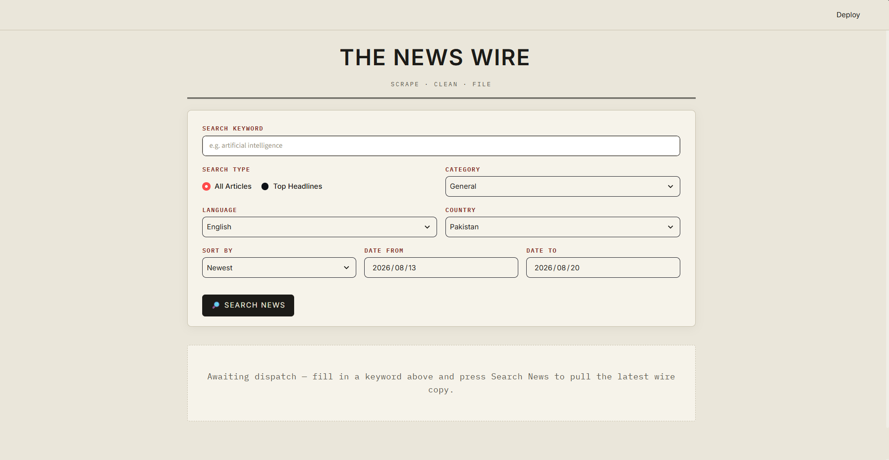
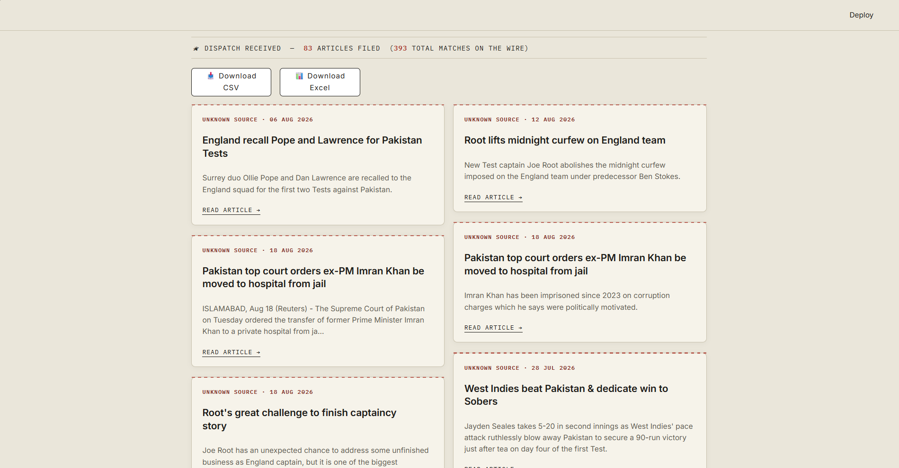

# 🚀 PROJECT NAME

> A modern, polished, and powerful project built with **[TECH STACK]**.

[](https://newsscrape-bvpfbhtr7atsw5ad3ek3sk.streamlit.app/)
[](https://github.com/malihamza56/News_Scraper.git)
[](LICENSE)

---

## 🌐 Live Demo

🔗 **[View Live Demo →](https://newsscrape-bvpfbhtr7atsw5ad3ek3sk.streamlit.app/)**


---

## 📌 Overview

**News Scraper** is a [is a modern scraping website which scrap news according to categories and give the latest articles to that one category and also provide the facility of download files in to Excel and CSV].

It is designed to provide a clean, modern, responsive, and user-friendly experience while focusing on **performance, usability, and simplicity**.

### ✨ Why This Project?

- 🎨 Modern & polished UI
- 📱 Fully responsive design
- ⚡ Fast and lightweight
- 🧩 Clean and organized code
- 🔧 Easy to customize
- 🚀 Production-ready structure

---

## 🖥️ Preview

### 🏠 Main Interface



---

### 📊 Dashboard / Main Output



---

## 🎯 Features

### ⭐ Core Features

- ✅ Input Keywords
- ✅ Country Feautures
- ✅ Latest Articles
- ✅ Excel and CSV reports
- ✅ Live Articles

### 🎨 UI / UX

- Modern interface
- Responsive layout
- Smooth animations
- Interactive components
- Clean typography
- Consistent color system
- Accessible UI elements

### ⚡ Performance

- Optimized assets
- Lightweight structure
- Efficient code
- Fast loading experience

---

## 🛠️ Tech Stack

| Technology | Purpose |
|---|---|
| 🟨 HTML5 | Structure |
| 🎨 CSS3 | Styling & UI |
| 🟦 JavaScript | Interactivity |
| ⚙️ [Technology] | [Purpose] |
| 🗄️ [Database] | Data Storage |

---

## 📂 Project Structure

```text
News_Scraper/
│
├── assets/
│   └── screenshots/
│       ├── dashboard.png
│       └── main-interface.png
│
├── data/
│   ├── processed/
│   └── raw/
│
├── logs/
│   └── scraper.log
│
├── src/
│   ├── api/
│   │   └── news_api.py
│   │
│   ├── config/
│   │   ├── config.py
│   │   └── logger.py
│   │
│   ├── exporter/
│   │   └── exporter.py
│   │
│   ├── extraction/
│   │   └── news.py
│   │
│   ├── serializer/
│   │   └── serialization.py
│   │
│   └── services/
│       └── cleaner.py
│
├── tests/
│   └── test_data.json
│
├── .env
├── .gitignore
├── app.py
├── requirements.txt
├── README.md
└── LICENSE
